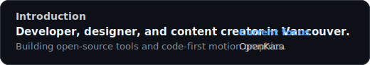

# Hi, I'm David

Developer, designer, and content creator in Vancouver. Building open-source tools and code-first motion graphics.

Current focus: [OpenKara](https://github.com/thedavidweng/OpenKara/).

## Metrics

## Tools

`Tauri 2` · `Rust` · `TypeScript` · `React` · `Next.js` · `Remotion`

## Links

[Personal Homepage](https://thedavidweng.github.io/) · [Portfolio](https://davidweng.eu.org/) · [GitHub](https://github.com/thedavidweng) · [LinkedIn](https://www.linkedin.com/in/thedavidweng) · [Instagram](https://www.instagram.com/davidwengpro/) · [YouTube](https://www.youtube.com/@davyweng) · [X](https://twitter.com/thedavidweng) · [Buy Me a Coffee](https://buymeacoffee.com/thedavidweng)
